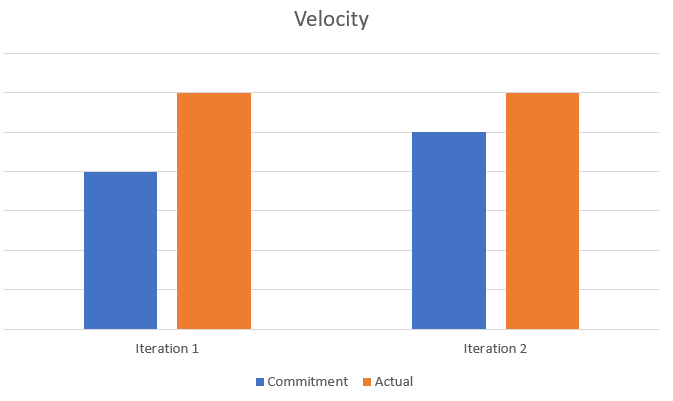

The retrospective following iteration 2 reflected both strengths and weaknesses of our team and helped us re-evaluate some techniques we used previously. 

In previous iterations, we failed to divide tasks amongst members efficiently, which caused conflicts when merging. We had to spend extra time fixing the new issues and ensuring the entire system ran as expected. By the end of iteration 2, we could not finish resolving errors from the database implementation. Even though we followed a common approach as the sample project, we realized that the database was not getting copied onto the emulator, thus failing our system as a whole. Furthermore, we felt that the communication between team members needed improvement. We were having weekly meetings, which we felt was not sufficient to keep the members updated and motivated on this project. Adding on, we ran out of time for iteration 2, leaving the code with some bugs and code smells. 

At the beginning of iteration 3, we decided to start early and fix the database before moving onto the features. We chose to switch from the HSQLDB to an SQLite database which took more time but helped us resolve the previous database errors. To improve our communication and keep each member updated, we decided to host meetings twice a week. One at the beginning of the week to brainstorm ideas and discuss what each member will work on. A second meeting to showcase the work done and successfully merge the code into one branch. This method helped us keep updated with the code and prevent conflicts. Once the merged branch was working as expected, we branched off from it to work on the rest. The features for iteration 3 were equally divided amongst team members to get more work done in less time. From our experience implementing android UI, we were able to get the features done faster in iteration 3. We also spent some time improving existing features. Our end goal was to eliminate all code smell issues opened by the marker in iteration 2, and have a system with enhanced user experience. 

Velocity Charts for iteration 1 and 2 are as follows:

